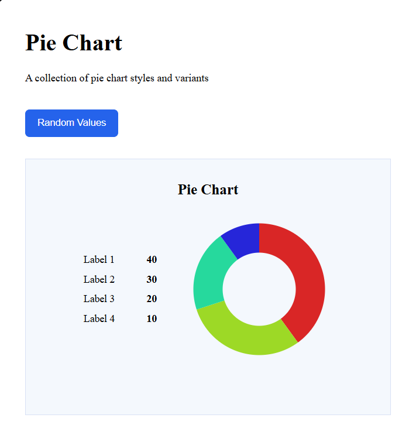

# Pie Chart

A simple and interactive pie chart UI component built with HTML, CSS, SVG and vanilla JavaScript.

## Preview

## Features

- SVG-based pie chart
- Dynamic chart segments
- Displays labels and values
- Random value generation
- Chart updates automatically after changing values
- Simple and reusable UI structure
- Built with vanilla JavaScript

## Technologies

- HTML5
- CSS3
- SVG
- Vanilla JavaScript
