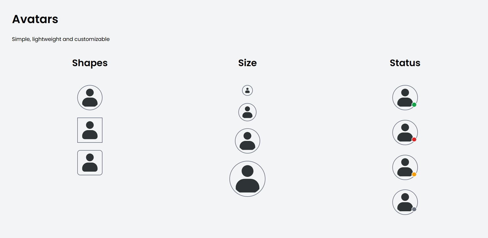

# Avatar

A lightweight and customizable avatar component showcasing common avatar variants used in modern user interfaces.

## Preview



## Features

- Circle, square, hexagon and octagon shapes
- Multiple avatar sizes
- Online, Away, Do Not Disturb and Offline status indicators
- Local SVG avatar asset
- Built with semantic HTML and modern CSS
- CSS Grid layout showcase

## Technologies

- HTML5
- CSS3
- CSS Grid
- CSS Variables

## Folder Structure

```text
avatar-1/
├── index.html
├── style.css
├── preview.png
└── README.md
```


## Future Improvements

- Image fallback (initials)
- Icon avatars
- Clickable avatars
- Group avatars (stacked)
- Avatar with notification badge
- Avatar upload state
- Hover and focus states
- Better hexagon/octagon border implementation
