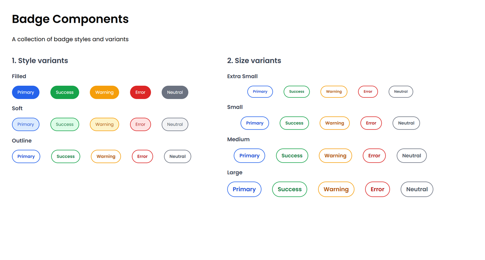

# Badge Component – Showcase

A collection of reusable badge components built with pure HTML and CSS.

---

## Preview




---

## Variants

### Style Variants

- Filled
- Soft
- Outline

### Color Variants

- Primary
- Success
- Warning
- Error
- Neutral

### Size Variants

- Extra Small (XS)
- Small (SM)
- Medium (MD)
- Large (LG)

---

## Features

- Filled, soft and outline styles
- Five semantic color variants
- Four predefined sizes
- CSS custom properties (design tokens)
- Reusable utility classes
- Modern pill-shaped design

---

## Technologies

- HTML5
- CSS3
- Flexbox
- CSS Variables

---

## Folder Structure

```text
Badge/
└── badge-1/
    ├── index.html
    ├── style.css
    ├── preview.png
    └── README.md
```

## Future Improvements

- Badges with icons
- Notification badges
- Dot badges
- Closable badges
- Interactive badge states
- Dark mode support
