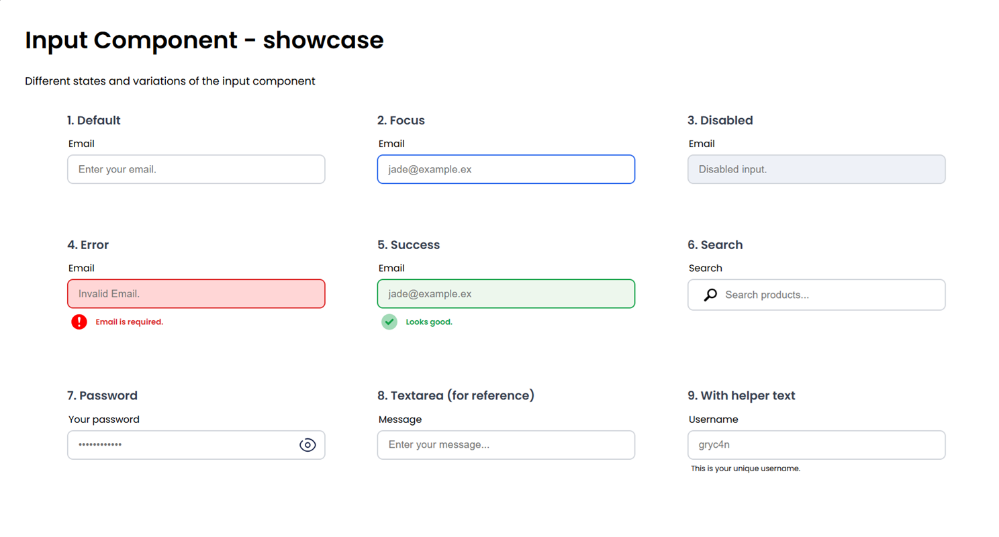

# Input Component – Showcase

A collection of common input field variations built with pure HTML and CSS.

---

## Preview



---

## Variants

- Default
- Focus
- Disabled
- Error
- Success
- Search
- Password
- Textarea (reference)
- Helper Text

---

## Features

- Rounded borders
- Custom focus state
- Error and success styles
- Disabled state
- Search input with icon
- Password input with icon
- Helper text
- Validation messages
- Modern UI appearance

---

## Technologies

- HTML5
- CSS3
- Flexbox

---

## Folder Structure

```text
Input/
└── input-1/
    ├── index.html
    ├── style.css
    ├── preview.png
    └── README.md
```

## Future Improvements

- Responsive layout
- JavaScript validation
- Password visibility toggle
- Search functionality
- Hover and focus animations
- Dark mode version
